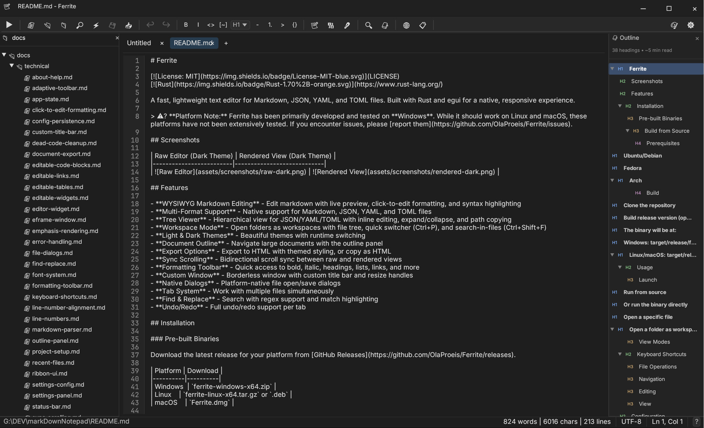
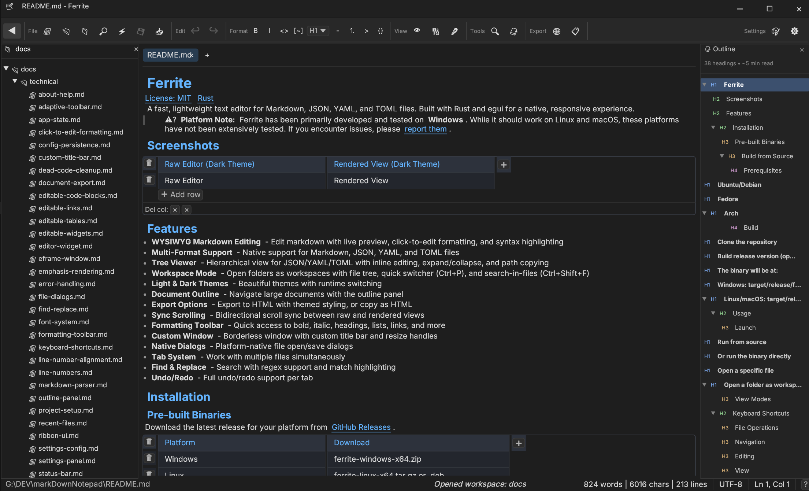

# Ferrite

[](LICENSE)
[](https://www.rust-lang.org/)

A fast, lightweight text editor for Markdown, JSON, YAML, and TOML files. Built with Rust and egui for a native, responsive experience.

> ⚠️ **Platform Note:** Ferrite has been primarily developed and tested on **Windows**. While it should work on Linux and macOS, these platforms have not been extensively tested. If you encounter issues, please [report them](https://github.com/OlaProeis/Ferrite/issues).

## Screenshots

| Raw Editor (Dark Theme) | Rendered View (Dark Theme) |
|-------------------------|----------------------------|
|  |  |

## Features

- **WYSIWYG Markdown Editing** - Edit markdown with live preview, click-to-edit formatting, and syntax highlighting
- **Multi-Format Support** - Native support for Markdown, JSON, YAML, and TOML files
- **Tree Viewer** - Hierarchical view for JSON/YAML/TOML with inline editing, expand/collapse, and path copying
- **Workspace Mode** - Open folders as workspaces with file tree, quick switcher (Ctrl+P), and search-in-files (Ctrl+Shift+F)
- **Light & Dark Themes** - Beautiful themes with runtime switching
- **Document Outline** - Navigate large documents with the outline panel
- **Export Options** - Export to HTML with themed styling, or copy as HTML
- **Sync Scrolling** - Bidirectional scroll sync between raw and rendered views
- **Formatting Toolbar** - Quick access to bold, italic, headings, lists, links, and more
- **Custom Window** - Borderless window with custom title bar and resize handles
- **Native Dialogs** - Platform-native file open/save dialogs
- **Tab System** - Work with multiple files simultaneously
- **Find & Replace** - Search with regex support and match highlighting
- **Undo/Redo** - Full undo/redo support per tab

## Installation

### Pre-built Binaries

Download the latest release for your platform from [GitHub Releases](https://github.com/OlaProeis/Ferrite/releases).

| Platform | Download |
|----------|----------|
| Windows  | `ferrite-windows-x64.zip` |
| Linux    | `ferrite-linux-x64.tar.gz` or `.deb` |
| macOS    | `Ferrite.dmg` |

### Build from Source

#### Prerequisites

- **Rust 1.70+** - Install from [rustup.rs](https://rustup.rs/)
- **Platform-specific dependencies:**

**Windows:**
- Visual Studio Build Tools 2019+ with C++ workload

**Linux:**
```bash
# Ubuntu/Debian
sudo apt install build-essential pkg-config libgtk-3-dev libxcb-shape0-dev libxcb-xfixes0-dev

# Fedora
sudo dnf install gcc pkg-config gtk3-devel libxcb-devel

# Arch
sudo pacman -S base-devel pkg-config gtk3 libxcb
```

**macOS:**
```bash
xcode-select --install
```

#### Build

```bash
# Clone the repository
git clone https://github.com/OlaProeis/Ferrite.git
cd Ferrite

# Build release version (optimized)
cargo build --release

# The binary will be at:
# Windows: target/release/ferrite.exe
# Linux/macOS: target/release/ferrite
```

## Usage

### Launch

```bash
# Run from source
cargo run --release

# Or run the binary directly
./target/release/ferrite

# Open a specific file
./target/release/ferrite path/to/file.md

# Open a folder as workspace
./target/release/ferrite path/to/folder/
```

### View Modes

Ferrite supports three view modes for Markdown files:

- **Raw** - Plain text editing with syntax highlighting
- **Rendered** - Read-only preview of rendered markdown
- **Both** - Split view with raw editor and live preview

Toggle between modes using the toolbar buttons or keyboard shortcuts.

## Keyboard Shortcuts

### File Operations

| Shortcut | Action |
|----------|--------|
| `Ctrl+N` | New file |
| `Ctrl+O` | Open file |
| `Ctrl+S` | Save file |
| `Ctrl+Shift+S` | Save as |
| `Ctrl+W` | Close tab |

### Navigation

| Shortcut | Action |
|----------|--------|
| `Ctrl+Tab` | Next tab |
| `Ctrl+Shift+Tab` | Previous tab |
| `Ctrl+P` | Quick file switcher (workspace) |
| `Ctrl+Shift+F` | Search in files (workspace) |

### Editing

| Shortcut | Action |
|----------|--------|
| `Ctrl+Z` | Undo |
| `Ctrl+Y` / `Ctrl+Shift+Z` | Redo |
| `Ctrl+F` | Find |
| `Ctrl+H` | Find and replace |
| `Ctrl+B` | Bold |
| `Ctrl+I` | Italic |
| `Ctrl+K` | Insert link |

### View

| Shortcut | Action |
|----------|--------|
| `F11` | Toggle fullscreen |
| `Ctrl+,` | Open settings |
| `F1` | Help/shortcuts |

## Configuration

Settings are stored in platform-specific locations:

- **Windows:** `%APPDATA%\ferrite\`
- **Linux:** `~/.config/ferrite/`
- **macOS:** `~/Library/Application Support/ferrite/`

Workspace settings are stored in `.ferrite/` within the workspace folder.

## Roadmap

See [ROADMAP.md](ROADMAP.md) for planned features and known issues.

## Contributing

Contributions are welcome! Please see [CONTRIBUTING.md](CONTRIBUTING.md) for guidelines.

### Quick Start for Contributors

```bash
# Fork and clone
git clone https://github.com/YOUR_USERNAME/Ferrite.git
cd Ferrite

# Create a feature branch
git checkout -b feature/your-feature

# Make changes, then verify
cargo fmt
cargo clippy
cargo test
cargo build

# Commit and push
git commit -m "feat: your feature description"
git push origin feature/your-feature
```

## Tech Stack

| Component | Technology |
|-----------|------------|
| Language | Rust 1.70+ |
| GUI Framework | egui 0.28 + eframe 0.28 |
| Markdown Parser | comrak 0.22 |
| Syntax Highlighting | syntect 5.1 |
| File Dialogs | rfd 0.14 |
| Clipboard | arboard 3 |
| File Watching | notify 6 |

## License

This project is licensed under the MIT License - see the [LICENSE](LICENSE) file for details.

## Acknowledgments

- [egui](https://github.com/emilk/egui) - Immediate mode GUI library for Rust
- [comrak](https://github.com/kivikakk/comrak) - CommonMark + GFM compatible Markdown parser
- [syntect](https://github.com/trishume/syntect) - Syntax highlighting library
- [Inter](https://rsms.me/inter/) and [JetBrains Mono](https://www.jetbrains.com/lp/mono/) fonts
