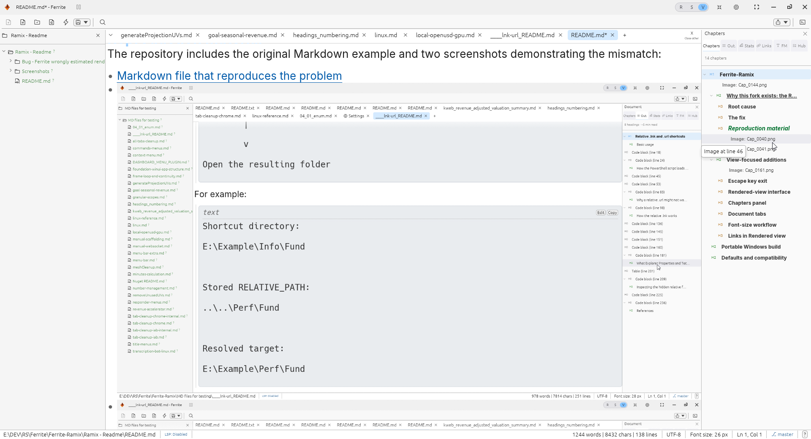
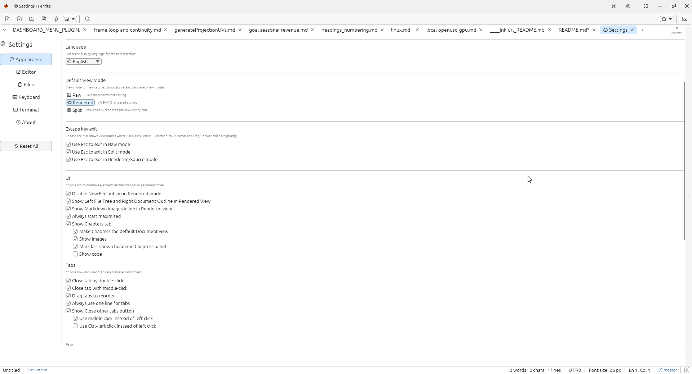

# Ferrite-Ramix

Ferrite-Ramix is my view-focused fork of [Ferrite](https://github.com/OlaProeis/Ferrite), based on Ferrite 0.3.0.

The fork started for one practical reason: to fix incorrect navigation from the document Outline to headings in Rendered view. Once that was fixed, I added a collection of optional controls that make Ferrite work better as a fast Markdown reader and document viewer, while keeping the original editor available.

All new behavior is configurable, and the new options default to **off** unless noted otherwise. The fork does not force a viewer workflow on users who prefer Ferrite's original behavior.



## Why this fork exists: the Rendered Outline navigation bug

In the original code, clicking some headings in the Outline did not scroll to the selected heading in Rendered view. It often stopped at the preceding heading or another nearby block. Clicking the next Outline entry could then land on the heading that should have been selected previously, leaving the Outline selection and the main view visibly out of step.

The failure depended on the document layout, which made it look intermittent. It became increasingly inaccurate after content whose rendered height differs from a plain source line, including:

- wrapped paragraphs;
- large headings;
- fenced code blocks;
- tables; and
- other multi-line rendered elements.

### Root cause

The navigation code estimated a rendered position using the source line number and a plain editor row height. That only works when every source line occupies exactly one equal-height rendered row—which Markdown rendering rather enthusiastically refuses to do.

In other words, the program mixed two coordinate systems:

```text
estimated Y = source line number × plain-text row height
```

The main viewer, however, contains measured rendered blocks with different heights. The estimate therefore accumulated error as the document progressed.

### The fix

Ferrite-Ramix navigates using the measured source-line-to-rendered-Y mapping produced by the rendered layout. The selected heading's source line is resolved against the real rendered block positions, and the viewport is placed using that mapped pixel offset. The older line estimate is retained only as a fallback when no rendered mapping is available yet.

This keeps the clicked Outline or Chapters entry aligned with the heading shown in the main Rendered view.

### Reproduction material

The repository includes the original Markdown example and two screenshots demonstrating the mismatch:

- [Markdown file that reproduces the problem](<Bug - Ferrite wrongly estimated rendered positions using source line × plain row height causing mismatch bwtween main view, and outline/____lnk-url_README.md>)
- [Bug screenshot 1](<Bug - Ferrite wrongly estimated rendered positions using source line × plain row height causing mismatch bwtween main view, and outline/Cap_0040.png>)
- [Bug screenshot 2](<Bug - Ferrite wrongly estimated rendered positions using source line × plain row height causing mismatch bwtween main view, and outline/Cap_0041.png>)

## View-focused additions

After fixing navigation, I added settings aimed at people who frequently use Ferrite as a Markdown viewer rather than only as a text editor. These controls are grouped under **Settings → Appearance**, with dedicated **Escape key exit**, **UI**, **Tabs**, and font-size sections.



### Escape key exit

Escape-to-exit can be enabled independently for each Markdown mode:

- **Raw mode**
- **Split mode**
- **Rendered mode**

Fullscreen, multi-cursor operations, and Find/Replace keep priority, so `Esc` still handles those active states before it exits Ferrite.

### Rendered-view interface

- **Disable New File button in Rendered mode** disables the toolbar's New File button while viewing a rendered document. Keyboard shortcuts and the tab-bar `+` remain available.
- **Show Left File Tree and Right Document Outline in Rendered View** automatically presents the workspace tree and document navigation around the rendered content.
- **Show Markdown images inline in Rendered view** displays standalone local images and standalone links to local image files inside the document, similar to GitHub. It is disabled by default.
- **Always start maximized** opens Ferrite maximized on every launch.

### Chapters panel

The optional **Show Chapters tab** setting provides a cleaner navigation view dedicated to document structure. The setting and all of its sub-options default to off.

- Includes Markdown headings from H1 through H6.
- Recognizes both ATX headings (`#`, `##`, and so on) and Setext-style titles underlined with repeated `=` or `-` characters.
- Preserves the hierarchy of `#` headings. Underlined titles are shown as flat chapters when no hierarchy is available.
- Uses a slightly larger, bold font than the standard Outline.
- Underlines the last chapter clicked.
- **Make Chapters the default Document view** selects Chapters when the Document panel first opens. Other Document tabs remain available.
- **Mark last shown header in Chapters panel** marks the most recently visible heading while scrolling or moving through Rendered view. The marker is slightly brighter, larger, bold, italic, and dark green.
- **Show code** adds indented, clickable `Code: preview words` references using words from the beginning of fenced code blocks.
- **Show images** adds indented, clickable `Image: filename` references for both `` syntax and ordinary links to supported image files. It defaults to off.

The Chapters panel uses the same corrected rendered-position mapping as the Outline, so its entries navigate to the actual rendered headings rather than a rough source-line estimate.

### Document tabs

Ferrite-Ramix adds these optional controls for heavy multi-document use. Every option defaults to off:

- **Close tab by double-click** closes the selected document tab with a double-click.
- **Close tab with middle-click** closes the selected document tab with the middle mouse button.
- **Drag tabs to reorder** lets tabs swap positions by dragging one onto another.
- **Always use one line for tabs** keeps the tab strip on one line; tabs that no longer fit are available from an overflow dropdown at the far left.
- **Show Close other tabs button** adds the small `X / Close other` button at the far right and closes every tab except the current one.
- **Use middle click instead of left click** or **Use Ctrl+left click instead of left click** changes the activation method for **Close other**. These two safety choices are mutually exclusive.

### Font-size workflow

- The status bar shows the active document's font size in pixels.
- **Use current font size for newly opened files** carries live zoom changes forward to the next document.
- Settings displays the currently remembered size beside this option.
- `Ctrl`+`+`, `Ctrl`+`-`, and `Ctrl`+mouse-wheel changes can therefore set the next document's starting size without reopening Settings.
- The carried size is clamped to a minimum of 6 px.

### Links in Rendered view

Rendered Markdown links support viewer-friendly mouse controls:

- left-click edits the link;
- middle-click opens it;
- `Ctrl`+left-click opens it; and
- right-click keeps its normal behavior and does not open the link.

Hovering a link shows a tooltip explaining these controls.

Local Markdown links use the same viewer controls. Middle-click or `Ctrl`+left-click resolves paths relative to the Markdown document (then the workspace) and opens supported files such as Markdown, JSON, and images in Ferrite. Hover tooltips state whether the target can be found and how to open it.

When inline display is disabled, image links open with middle-click or `Ctrl`+left-click. When inline display is enabled, double-click the rendered image to open it in a new Ferrite tab. Right-click remains untouched.

### Linked-file Back navigation

Files opened from another Ferrite document retain their parent tab, including images and supported source files such as Markdown and JSON. The child tab displays an on-screen **Back** button. Any of these controls returns to its parent:

- the on-screen **Back** button;
- `Ctrl`+`Backspace`;
- `Alt`+`Left`; or
- the mouse Back button.

Plain `Backspace` keeps its normal editing behavior.

## Portable Windows build

The Windows package uses Ferrite's native portable layout:

```text
ferrite.exe
portable/
```

When the `portable` directory exists beside `ferrite.exe`, configuration and session data stay with the application instead of requiring a separate launcher executable. A fast release-build batch file is also included; it builds the optimized portable package directly without running a redundant `cargo check` first.

## Defaults and compatibility

The fork's Rendered-view UI, inline-image display, Chapters and its sub-options, tab-management, font carry-forward, maximized startup, and Escape-to-exit settings default to **off**. Existing users therefore keep the original interaction model until they deliberately enable additions in **Settings → Appearance**. Status-bar font-size reporting, link tooltips, supported local-file opening, corrected Outline navigation, and linked-file Back controls do not require separate settings.

Ferrite-Ramix remains a fork of Ferrite, not a replacement for the upstream project. The goal is narrower: correct Rendered-view navigation and provide a practical, configurable reading workflow for large Markdown collections.
