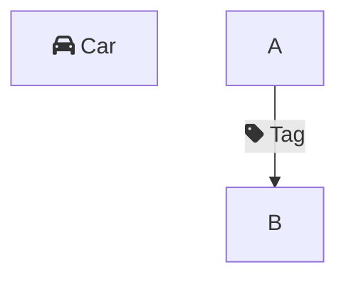

# Flowchart Font Awesome label prefixes (FC-83b)

Strips Mermaid inline Font Awesome icon syntax from displayed flowchart node and edge labels so literal `fa:fa-car` text no longer appears in the diagram.

## Mermaid syntax

Mermaid allows Font Awesome icons embedded in node labels:

Ferrite does **not** render the actual Font Awesome glyph (no FA font/CSS). Prefix tokens are removed at parse time; the remaining text is shown with the normal proportional label font.

## Supported stripping

| Prefix pattern | Example input | Displayed label |
|----------------|---------------|-----------------|
| `fa:fa-<name>` | `fa:fa-car Car` | `Car` |
| `fab:fa-<name>` | `fab:fa-github GitHub` | `GitHub` |
| Multiple leading icons | `fa:fa-box fa:fa-arrow-right Order` | `Order` |

Rules:

- Only **leading** prefixes are stripped (after optional leading whitespace). Mid-label tokens such as `Hello fa:fa-car world` are left unchanged.
- Icon names match `[a-zA-Z0-9-]+` after the prefix.
- ` `, ` `, and ` ` are still converted to newlines before prefix stripping.

## Design choice: no placeholder icon

Node and edge labels render with `FontId::proportional()` in `flowchart/render/nodes.rs` and `flowchart/render/edges.rs`. Injecting a Phosphor glyph into the label string would not display correctly without a mixed-font render path. The shipped behavior is **strip-only** — users see the human-readable suffix (e.g. `Car`) without a generic icon substitute.

Real Font Awesome rendering remains out of scope (requires external icon assets and mixed layout).

## Implementation

All labels pass through `clean_label()` in `flowchart/parser.rs`:

1. Convert HTML line breaks to `\n`.
2. Loop `strip_one_font_awesome_icon_prefix()` on the trimmed start until no prefix matches.

Applies to node labels (all shapes) and edge labels (`|text|` and dash-style labels).

## Tests

Unit tests in `flowchart/parser.rs` (`clean_label_*`):

- `fa:` and `fab:` prefix stripping
- Mid-label prefix unchanged
- Labels without prefix unchanged
- Multiple leading prefixes
- Edge label stripping
- FC-83b fixture: `F[fa:fa-car Car]` → node label `"Car"`

Manual repro: `test_md/test_mermaid_issue_83.md` (FC-83b section).

## Parity status

See [Mermaid Parity Matrix](./mermaid-parity-matrix.md): `fa:fa-*` inline labels — **Partial** (prefix stripped; icon not rendered).
