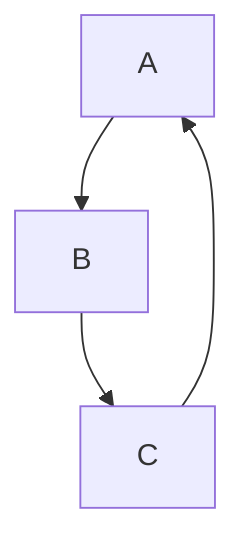
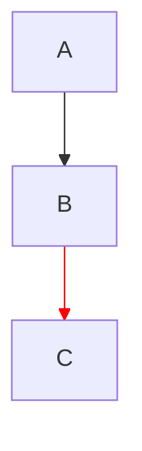

# Flowchart linkStyle `interpolate basis`

Smooth edge curves via Mermaid's `linkStyle … interpolate basis` directive (FC-83a / #83).

## Mermaid Syntax



Per-edge override:



## Supported vs unsupported

| Property | Status | Notes |
|----------|--------|-------|
| `interpolate basis` | OK | Catmull-Rom splines on routed polyline paths |
| `stroke`, `stroke-width` | OK | See [flowchart-linkstyle.md](./flowchart-linkstyle.md) |
| `stroke-dasharray` | Missing | P2 — not parsed or rendered |

## Parser

`parse_link_style()` in `flowchart/parser.rs`:

1. Parses colon-separated CSS (`stroke`, `stroke-width`) as before.
2. Scans whitespace/comma-separated tokens for the pair `interpolate` + `basis` (case-insensitive).
3. Sets `LinkStyle.interpolate_basis = true` on the indexed or `default` style.

No parse or validation warning is emitted for `interpolate basis`.

## Renderer

When `interpolate_basis` is true on the resolved link style (per-edge index, else `default_link_style`):

- `draw_edge()` in `flowchart/render/edges.rs` passes the flag into normal and back-edge draw paths.
- Orthogonal route segments are converted to waypoints and drawn with Catmull-Rom sampling (`flowchart/utils.rs`: `sample_catmull_rom_path`, `draw_catmull_rom_path`).
- Arrow heads use curve tangents (`catmull_rom_path_end_tangent` / `_start_tangent`).
- Edge labels use `catmull_rom_path_midpoint` when interpolating.

Routing (obstacle avoidance, back-edge lanes, subgraph crossings) is unchanged — only the stroke between waypoints becomes curved.

## Data model

```rust
pub struct LinkStyle {
    pub stroke: Option<Color32>,
    pub stroke_width: Option<f32>,
    pub interpolate_basis: bool,
}
```

Stored on `Flowchart.link_styles` and `Flowchart.default_link_style`.

## Tests

| Test | Location |
|------|----------|
| `link_style_default_interpolate_basis_parsed` | `flowchart/parser.rs` |
| `link_style_index_interpolate_basis_parsed` | `flowchart/parser.rs` |
| `flowchart_link_style_interpolate_basis_validates` | `mermaid/validation.rs` |
| `catmull_rom_corner_bulges_away_from_sharp_turn` | `flowchart/utils.rs` |

Manual repro: `test_md/test_mermaid_issue_83.md` (FC-83a).

## Related

- [Flowchart linkStyle](./flowchart-linkstyle.md) — stroke color/width
- [Flowchart edge obstacle routing](./flowchart-edge-obstacle-routing.md) — routing before curve smoothing
- [Mermaid parity matrix](./mermaid-parity-matrix.md) — feature status row
