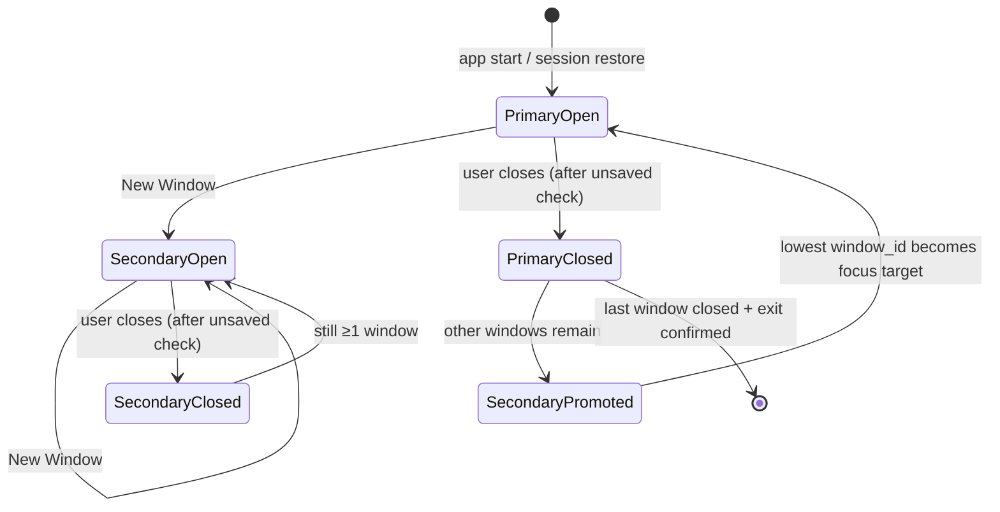

# Multi-Window Architecture (Design)

**Status:** Design document — required before implementation ([#125](https://github.com/OlaProeis/Ferrite/issues/125)).  
**Scope:** Architecture only; no code in this task.

## Overview

Ferrite v0.3.1 adds **OS-level multi-window** so users can compare two markdown files side by side (e.g. two LLM outputs). Today the app is **single-window, single-process**: one `eframe::run_native` root viewport, all tabs in one strip, and a [single-instance protocol](./single-instance.md) that forwards Explorer launches to that window.

This document defines the process model, viewport lifecycle, tab ownership, single-instance routing, and session persistence shape. Implementation must not start until this doc is merged.

### MVP (user-visible)

| Feature | Behaviour |
|---------|-----------|
| **New Window** | Menu / command palette action spawns a second OS window with its own tab strip |
| **Open file** | Routes to the **focused** document window |
| **Close last tab** | Same as today within that window (auto-create empty tab); closing the last **window** follows exit semantics |
| **Session restore** | All windows, tab sets, and geometries restored |

### Explicit non-goal (MVP)

**Productivity Hub pop-out on a second monitor** is **out of scope** for the multi-window MVP. The Hub today uses an in-app `egui::Window` (docked vs floated — see [productivity-panel.md](../productivity/productivity-panel.md)). A follow-up may promote it to a dedicated `egui` viewport using the same infrastructure as document windows; that work is not part of [#125](https://github.com/OlaProeis/Ferrite/issues/125) MVP.

---

## 1. Process model

### Decision: one process, multiple egui viewports

Ferrite will use **one OS process** hosting **multiple `egui` viewports** (root + child viewports via `Context::show_viewport_immediate`), not multiple independent Ferrite processes.

```
┌─────────────────────────────────────────────────────────────────┐
│                     Ferrite OS process                          │
│  ┌──────────────────┐  ┌──────────────────┐  ┌───────────────┐ │
│  │ Shared process   │  │ FerriteApp       │  │ Background    │ │
│  │ state            │  │ (eframe::App)    │  │ threads       │ │
│  │ · settings       │  │ · ROOT viewport  │  │ · single-inst │ │
│  │ · workspace/git  │  │ · child viewports│  │ · file load   │ │
│  │ · LSP/diagnostics│  │ · per-frame UI   │  │ · PTY/LSP     │ │
│  │ · tab store      │  │                  │  │               │ │
│  └──────────────────┘  └──────────────────┘  └───────────────┘ │
│           ▲                        ▲                              │
│           │    tab open/close      │    ViewportCommand::Focus   │
│           └────────────────────────┘                              │
└─────────────────────────────────────────────────────────────────┘
         ▲                                    ▲
         │ Explorer / CLI (secondary)         │ User: Window → New Window
         └──────── single-instance TCP ───────┘
```

### Justification vs multi-process

| Criterion | One process + viewports | Multiple processes |
|-----------|-------------------------|-------------------|
| **Single-instance protocol** | Keep one lock file + one TCP listener; route paths to focused window | Would need redesign (per-process locks or a broker); breaks today’s “instant forward” model |
| **Session / crash recovery** | One `session.json`, atomic save of all windows | Split or merged sessions; recovery conflicts across processes |
| **Tab identity** | Global `tab_id` namespace (required by recovery files) | IDs collide or need cross-process registry |
| **Workspace / git / LSP** | One workspace root, one watcher, one LSP manager | Duplicate watchers, duplicate language servers, stale diagnostics |
| **Memory** | Shared font caches, Mermaid layout cache, settings | Duplicate caches (~MB per instance) |
| **egui 0.34** | `show_viewport_immediate` already used for terminal pop-outs (`terminal_panel.rs`) | N/A |
| **Platform QA** | Same matrix as today + z-order between own windows | Extra IPC, focus stealing between processes |

Multi-process is rejected unless a platform blocker forces it (none identified for Windows/macOS/Linux X11+Wayland with eframe 0.34 glow/wgpu).

### Shared vs per-window state

| State | Scope | Notes |
|-------|-------|-------|
| `Settings` | Process | One `settings.json`; window geometry moves to session (below) |
| `AppMode` / `Workspace` | Process | One workspace root; all windows share file tree, git, search |
| `Tab` documents | Process | Global store keyed by `tab_id`; each window holds an ordered subset |
| Tab strip UI | Per window | Active tab, scroll, close, drag-between-windows (later) |
| Ribbon / sidebar visibility | Per window (optional) | MVP may mirror root layout in child windows; zen mode can stay global initially |
| `FerriteApp` per-tab caches | Per window or keyed by `tab_id` | `tree_viewer_states`, `sync_scroll_states`, etc. stay keyed by `tab_id` |
| Video WebView manager | Per viewport | Embed lifecycle tied to focused viewport’s preview pane (see [video-embeds.md](../markdown/video-embeds.md)) |
| Single-instance listener | Process | One background accept thread |

---

## 2. Window / viewport lifecycle

### Viewport mapping

| Window kind | `egui::ViewportId` | Creation |
|-------------|-------------------|----------|
| **Primary** | `ViewportId::ROOT` | `eframe::run_native` in `main.rs` (unchanged entry) |
| **Secondary document windows** | `ViewportId::from_hash_of(("document_window", window_id))` | `ctx.show_viewport_immediate` from root frame (same pattern as terminal pop-outs) |

Stable `window_id: u32` is assigned at creation and persisted in session files. The egui viewport id is derived from it so restore can recreate the same viewport identity.

### Lifecycle



**Create (`New Window`):**

1. Allocate `window_id` from `next_window_id`.
2. Push `DocumentWindowState` with empty tab strip (one new untitled tab).
3. Call `show_viewport_immediate` with `ViewportBuilder` (title, size ~1200×800, offset from primary).
4. Set `focused_window_id` to the new window; send `ViewportCommand::Focus`.

**Per-frame:**

- Root `FerriteApp::update` iterates open document windows and runs the same central-panel path with a `WindowContext { window_id, viewport_id }`.
- `update_window_geometry()` writes outer rect / maximized flag into `DocumentWindowState.geometry` (debounced, like today’s `last_window_size` on root).

**Close:**

- Intercept `viewport().close_requested()` per viewport.
- If **any tab** in **that window** is modified → confirmation dialog (scoped to that window’s tabs).
- If closing the **last** window → delegate to existing app exit flow (`request_exit`, global unsaved check across **all** windows).
- If closing a non-last window → remove `DocumentWindowState`, drop viewport (egui closes child viewport when not shown next frame).
- **Primary closed while secondaries exist:** promote focus to the surviving window with smallest `window_id`; no need to migrate `ViewportId::ROOT` — root viewport can remain the “first” window only, or implementation may treat `window_id == 0` as root consistently.

**Platform notes:**

- Reuse [window-resize.md](./window-resize.md) borderless resize on each viewport that uses custom chrome.
- Idle repaint ([idle-mode-optimization.md](./idle-mode-optimization.md)): child viewports register interaction on their own `Context`; root coordinates `request_repaint_after` when any window is active.
- QA matrix: Windows, macOS, Linux X11 + Wayland — z-order, focus, and close semantics per [#125](https://github.com/OlaProeis/Ferrite/issues/125).

---

## 3. Tab ownership model (`src/state.rs`)

### Problem today

`AppState` owns a flat `tabs: Vec<Tab>`, `active_tab_index`, and `next_tab_id`. All UI assumes one strip. Tab ids are **process-global** (recovery/autosave depend on this — see [session-persistence.md](../files/session-persistence.md)).

### Target model

Split **document storage** (global) from **window presentation** (per viewport).

```rust
/// Stable id for an OS document window (persisted in session).
pub type WindowId = u32;

/// Per-window tab strip + chrome. Lives in process-global state.
pub struct DocumentWindowState {
    pub id: WindowId,
    /// Derived each run: ViewportId::from_hash_of(("document_window", id))
    pub viewport_id: egui::ViewportId,
    /// Ordered tab strip; each id exists in `AppState::tabs`.
    pub tab_ids: Vec<usize>,
    pub active_tab_index: usize,
    pub geometry: WindowGeometry,
}

pub struct WindowGeometry {
    pub width: f32,
    pub height: f32,
    pub x: Option<f32>,
    pub y: Option<f32>,
    pub maximized: bool,
}

pub struct AppState {
    // ── Multi-window (new) ──
    pub windows: Vec<DocumentWindowState>,
    pub focused_window_id: WindowId,
    next_window_id: WindowId,

    // ── Tabs (global store, unchanged id semantics) ──
    tabs: HashMap<usize, Tab>,   // or Vec<Tab> + window_id on Tab — see below
    next_tab_id: usize,

    // ── Shared (unchanged) ──
    pub settings: Settings,
    pub ui: UiState,
    pub app_mode: AppMode,
    pub workspace: Option<Workspace>,
    // git, LSP, diagnostics, recovery_conflicts, …
}
```

**Recommended tab storage:** keep `HashMap<usize, Tab>` (or `Vec<Tab>` with a `owner_window_id: WindowId` field on `Tab`) so moving a tab between windows is a strip mutation, not a deep copy. `Tab` itself is unchanged except optional `owner_window_id` for invariant checks.

### Ownership rules

| Rule | Detail |
|------|--------|
| **Exactly one owner** | Each tab id appears in at most one window’s `tab_ids` |
| **Open file** | Create tab in global store; append id to **focused** window’s strip; activate it |
| **Duplicate path** | If path already open, focus the owning window and activate that tab (today’s behaviour, extended with cross-window focus) |
| **Close tab** | Remove id from window strip; if global tab unreferenced, destroy tab + prune recovery files |
| **Close window** | Close all tabs in that strip (with unsaved prompts) or move tabs — **MVP: close with prompts**, no auto-move |
| **New window** | Starts with one empty tab; does not clone existing tabs |
| **Drag tab to other window** | Post-MVP; design leaves room for `move_tab_to_window(tab_id, target_window_id)` |

### Focus tracking

```rust
impl AppState {
    pub fn focused_window(&self) -> &DocumentWindowState { … }
    pub fn focused_window_mut(&mut self) -> &mut DocumentWindowState { … }

    /// Called when a viewport gains OS focus (egui viewport event).
    pub fn set_focused_window(&mut self, id: WindowId) {
        self.focused_window_id = id;
    }

    /// Active tab is always per-window.
    pub fn active_tab(&self, window_id: WindowId) -> Option<&Tab> { … }
    pub fn active_tab_mut(&mut self, window_id: WindowId) -> Option<&mut Tab> { … }
}
```

**Invariant:** `active_tab_index` is **per window**, not global. Code that today uses `self.active_tab_index` must take `WindowId` (or `WindowContext` passed from the viewport loop).

### `FerriteApp` integration sketch

```rust
struct WindowContext {
    window_id: WindowId,
    viewport_id: egui::ViewportId,
}

impl FerriteApp {
    fn update(&mut self, ctx: &egui::Context, frame: &mut eframe::Frame) {
        // 1. Poll single-instance → route to state.focused_window_id
        // 2. For each DocumentWindowState:
        //      show_viewport_immediate(viewport_id, …, |ctx, _| self.update_document_window(ctx, wc))
        // 3. Shared panels (settings modal) may stay root-only
    }
}
```

Per-tab auxiliary maps in `FerriteApp` (`tree_viewer_states`, `csv_viewer_states`, …) remain keyed by **`tab_id`**, not window id.

---

## 4. Single-instance interaction

Today ([single-instance.md](./single-instance.md)): secondary process sends paths (or `__FOCUS__`) over TCP; primary opens tabs in the only window and sends `ViewportCommand::Focus` to root.

### Chosen behaviour (multi-window)

| Incoming message | Action |
|------------------|--------|
| **One or more file paths** | Open each path in the **last-focused document window** (`AppState::focused_window_id`). If that window was closed race-side, fall back to `windows[0]`. |
| **Directory path** | Open workspace **process-wide** (unchanged); focus the window that initiated workspace mode, or last-focused if none. |
| **`__FOCUS__` (bare launch)** | Raise **last-focused** window: `ViewportCommand::Focus` + `RequestUserAttention` on that viewport id. |
| **No listener (config failure)** | Same as today — each launch is a full new process (degraded mode). |

Secondary instances **do not** auto-spawn a new document window. Users explicitly choose **New Window** when they want a second strip; Explorer double-click should not silently multiply windows.

### Protocol changes

**MVP: no wire-format change.** The accept thread still delivers `Vec<PathBuf>` to the UI thread. Routing uses `focused_window_id` instead of assuming root.

**Optional follow-up (not MVP):** extend the protocol with a line such as `__WINDOW__:{window_id}` so automation can target a specific window. Not required for Explorer integration.

### Focus synchronization

1. Each viewport calls `set_focused_window(id)` when it receives focus (egui `ViewportEvent` or input focus).
2. `handle_instance_paths()` (in `file_ops.rs`) uses `send_viewport_cmd_to(target_viewport_id, Focus)` instead of only root.
3. Windows foreground handoff (`AllowSetForegroundWindow`) remains unchanged — one primary PID.

---

## 5. Session persistence shape (`src/config/session.rs`)

### Goals

- Persist **all document windows**: tab lists, per-window active tab, geometry.
- Keep **global** workspace mode and zen flag at session top level.
- **Backward compatible:** loading v1 `session.json` (flat tabs) restores a **single** primary window.
- Preserve **tab_id** stability within a session for recovery file correlation.

### Schema version bump: `1` → `2`

```rust
pub const SESSION_VERSION: u32 = 2;

#[derive(Debug, Clone, Serialize, Deserialize)]
pub struct SessionState {
    pub version: u32,
    pub saved_at: u64,
    pub clean_shutdown: bool,

    /// Multi-window payload (v2+). Missing or empty → legacy loader path.
    #[serde(default)]
    pub windows: Vec<SessionWindowState>,

    /// v1 flat layout — still written as empty when v2 windows is populated;
    /// populated on save when only migrating down-level readers.
    #[serde(default)]
    pub tabs: Vec<SessionTabState>,
    #[serde(default)]
    pub active_tab_index: usize,

    #[serde(default)]
    pub app_mode: SessionAppMode,
    #[serde(default)]
    pub zen_mode: bool,

    /// Index into `windows` for last-focused window (v2+).
    #[serde(default)]
    pub focused_window_index: usize,
}

#[derive(Debug, Clone, Serialize, Deserialize)]
pub struct SessionWindowState {
    pub window_id: u32,
    pub tabs: Vec<SessionTabState>,
    pub active_tab_index: usize,
    #[serde(default)]
    pub geometry: SessionWindowGeometry,
}

#[derive(Debug, Clone, Serialize, Deserialize, Default)]
pub struct SessionWindowGeometry {
    pub width: f32,
    pub height: f32,
    #[serde(skip_serializing_if = "Option::is_none")]
    pub x: Option<f32>,
    #[serde(skip_serializing_if = "Option::is_none")]
    pub y: Option<f32>,
    #[serde(default)]
    pub maximized: bool,
}
```

`SessionTabState` is **unchanged** — still carries `tab_id`, path, cursor, scroll, recovery flags, etc.

### Capture (`capture_session_state`)

```rust
pub fn capture_session_state(&self) -> SessionState {
    let windows: Vec<SessionWindowState> = self
        .windows
        .iter()
        .map(|w| SessionWindowState {
            window_id: w.id,
            tabs: w.tab_ids.iter().map(|id| self.tab_to_session_tab_state(*id)).collect(),
            active_tab_index: w.active_tab_index,
            geometry: w.geometry.into(),
        })
        .collect();

    SessionState {
        version: SESSION_VERSION,
        focused_window_index: self.focused_window_index(),
        windows,
        tabs: vec![],              // v2: prefer windows[]
        active_tab_index: 0,
        app_mode: …,
        zen_mode: …,
        …
    }
}
```

### Restore (compatibility)

```text
load session.json
  │
  ├─ version < 2 OR windows.is_empty()
  │     └─ Legacy path:
  │           · Build one DocumentWindowState { window_id: 0, tabs: session.tabs, … }
  │           · geometry from Settings.window_size (today’s behaviour)
  │           · focused_window_id = 0
  │
  └─ version >= 2 AND windows non-empty
        └─ Multi-window path:
              · Rebuild each DocumentWindowState + global tab map
              · focused_window_id = windows[focused_window_index].window_id
              · Recovery/autosave: unchanged identity rules (tab_id + path + hash)
```

**Compatibility notes for old session files:**

| File | Behaviour |
|------|-----------|
| v1 `session.json` with flat `tabs` | Restores exactly one window; no data loss |
| v1 `session.recovery.json` after crash | Same — single window |
| `recovery/<tab_id>.json` | Still keyed by `tab_id`; pruning uses global tab set after multi-window restore |
| `Settings.window_size` | Still default for **first** window when no geometry in v1 session; v2 stores geometry per window in session, not settings |

Forward compatibility: unknown `version > 2` → reject with log + start fresh (existing pattern).

### Window geometry vs settings

Today `Settings.window_size` persists primary window bounds on shutdown. After multi-window:

- **Primary/default geometry** for brand-new sessions: still seed from `Settings.window_size`.
- **Saved sessions:** per-window `SessionWindowGeometry` is authoritative.
- Optional: on shutdown, mirror **focused** window geometry back into `Settings.window_size` so non-session restarts feel familiar.

---

## 6. Implementation map (reference)

| Area | Files |
|------|-------|
| Viewport loop | `src/app/mod.rs`, `src/main.rs` |
| Tab / window state | `src/state.rs` |
| Single-instance routing | `src/single_instance.rs`, `src/app/file_ops.rs` |
| Session capture/restore | `src/config/session.rs`, `src/state.rs` (`capture_session_state`, `restore_from_session_result`) |
| Prior art (child viewports) | `src/ui/terminal_panel.rs` (`show_viewport_immediate`) |
| Commands | `src/config/settings.rs` (`ShortcutCommand`), `src/app/central_panel.rs`, menu/ribbon |

Suggested implementation order: session schema + in-memory window model → secondary viewport render path → New Window command → single-instance routing → session restore QA.

---

## 7. Related documentation

- [Single-Instance Protocol](./single-instance.md) — lock file, TCP, focus handoff
- [Session Persistence](../files/session-persistence.md) — recovery, tab_id identity
- [Tab System](../files/tab-system.md) — current single-window tab model
- [eframe / egui 0.34 Upgrade](./eframe-egui-034-upgrade.md) — viewport rects API
- [Productivity Panel](../productivity/productivity-panel.md) — in-app float (not OS window MVP)
