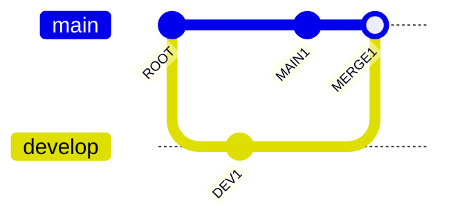
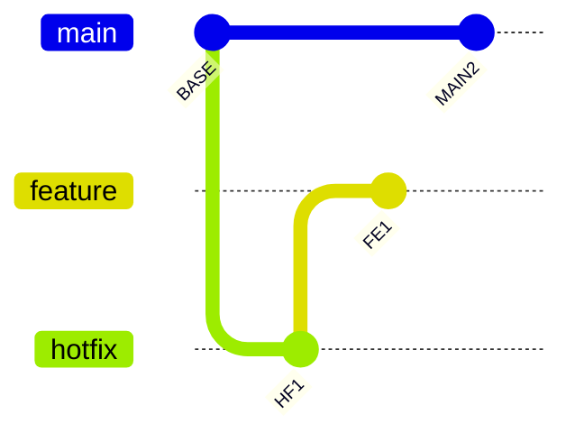

# Git Graph Test Fixtures

Manual repro file for the v0.3.1 gitGraph lane rewrite. Open in Ferrite Rendered or Split view and compare topology (lanes, branch-offs, merges, cherry-picks, tags) to [Mermaid Live Editor](https://mermaid.live).

Fixture topology is also verified by unit tests in `git_graph/parser.rs` (`fixture_*_topology`).

---

## GG-01 — Feature branch + merge



**Expected topology (matches Mermaid Live):**

| Element | Value |
|---------|-------|
| Lanes | `main` = lane 0, `develop` = lane 1 |
| Sequence | ROOT → DEV1 → MAIN1 → MERGE1 (left → right) |
| Branch-off | `develop` diverges from ROOT on `main` |
| Merge | Connector from DEV1 (develop tip) → MERGE1 on `main` |
| Labels | "Feature work", "Mainline fix", "Merge develop" |

---

## GG-02 — Multi-branch with `order:`



**Expected topology (matches Mermaid Live):**

| Element | Value |
|---------|-------|
| Lanes | `main` = 0, `feature` = 1 (`order: 1`), `hotfix` = 2 (`order: 2`) |
| Branch-offs | `hotfix` and `feature` both diverge from BASE |
| Vertical order | main (top) < feature < hotfix (bottom) |
| Sequence | BASE → HF1 → FE1 → MAIN2 |

---

## GG-03 — Tags + cherry-pick

```mermaid
gitGraph
  commit id: "abc" tag: "v1.0" type: NORMAL
  branch release
  commit id: "rel1" tag: "v1.1"
  checkout main
  cherry-pick id: "abc"
  commit type: HIGHLIGHT
```

**Expected topology (matches Mermaid Live):**

| Element | Value |
|---------|-------|
| Lanes | `main` = 0, `release` = 1 |
| Tags | `v1.0` on abc, `v1.1` on rel1 |
| Cherry-pick | Dashed connector from abc → cherry-pick commit on `main` |
| Dot styles | NORMAL (abc), HIGHLIGHT (last commit on main) |
| Branch-off | `release` diverges from abc on `main` |
