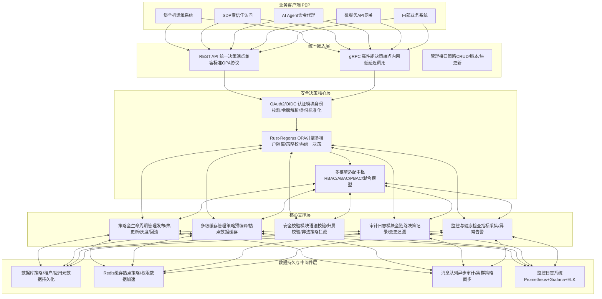
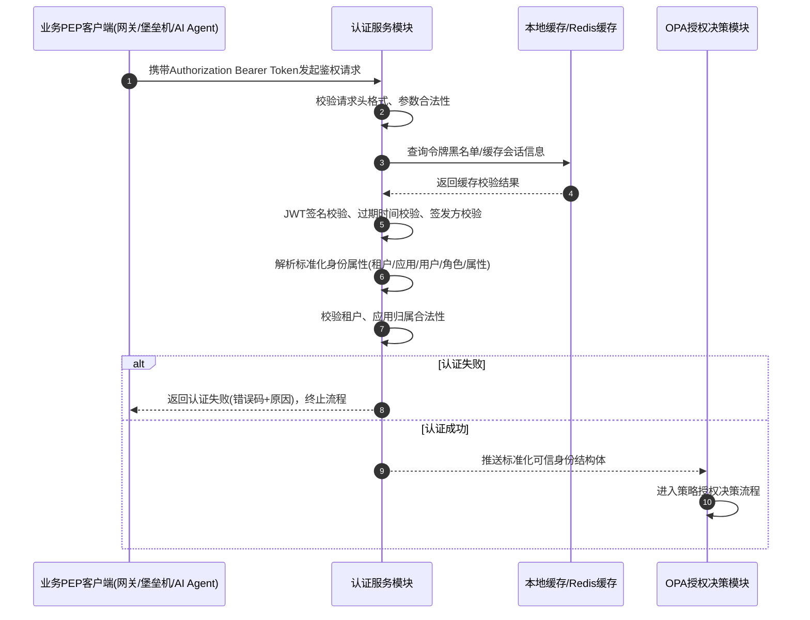

# Mermaid Issue #165 — Fidelity Test Fixtures

GitHub: [#165 — Mermaid diagrams fail to auto-scale and render incorrectly](https://github.com/OlaProeis/Ferrite/issues/165)

Open in **Rendered** or **Split** view and compare each diagram to its
[Mermaid Live Editor](https://mermaid.live) link below.

These fixtures exercise inline fit-to-pane, dense `&` fan-out, cross-subgraph
`<-->` edges, CJK/multi-word subgraph titles, and `sequenceDiagram autonumber`.

---

## FC-165a — Layered-architecture flowchart (dense fan-out)

**Mermaid Live:** [Open layered-architecture diagram](https://mermaid.live/edit#pako:fVZNbxs5DP0rhg-9dANLGn0WxQKOx1gEu0AMt3uye5BmpKTAxlnYnlPR_758UuxoJt34QMxwSJF8fKT8Y94993H-af5w9P8-zr62-8OMfqchFMV-kJH7_aCE5ySDF_tBi8bsB-Njmm3Wm-KA35LvyMQKGBoHQ9OQq009I_OYJMkuBTz36VvlJ3Zf2s1-cDppipciR1QY2hAS6VWMtXmzW97Nlg_xcKZA0vSwjjLLhg6XTNfWEkklH5EO60sly80dGSaFTLlpanMFc24VhWXRjst_k3089PvDG8RgAEdGZevGKxyoITspXiPd8t12_eXrjHKZ-CgeUEdQuqBMkgWXU-3QAzxryww0nb7fLOmhkQlw-RqoW7F72G5WdLrzPZWimSAfy1L_XgyUXqCRSRJqKqIr1EQE6Bi8lLB1mGaHkzJAhP215ia-RlBarbZ_twt6FBKpGNHhhUXKRWtQQ6vA3oVVBZsT1HacvrYNNKlrphCv-O5-OZwfxeL-rgUOBJCE7ChX7QtRFTCJPmTOIZtMYOctEizEopwJeOtQkDaOLaYel16gal6zbyV22-F0vtnGh-fjcJqVZiVO-GjZAV0HehkHdMtcOe0Q0oWwqOGbJPZrvtSR0ZVy-qVSG0BqRoPpuMxTI5C98WJ7u1wtlhAbCFL2CSVJZmv3d9tTt0ErgXqk49OWtHw3rqr00yieLsOspM4MgaamlWp6HBdZ8wvmZJUBGNFrelG6x8TH3leYtOKKiYkeOyxxkCYoOw5VJ-isldkSUxB6fg1eBkYrk8dcx_q4OmhuRMXd1z5OSBhySV0_7bVKSgBHFScfnMmq7DFiioiYCyFGxedFmIu0WWoVgX_qzTiPkqWjPUyWPVZDPW20kllOSS1yS-ylCzblWYi-Xu0t1qnRaBxtBZMZC9az3PoYEJqWCtqNZHTDzGWeHO_yNHS5nQm0VTFTTErcKkHr9_lYNYbOzXeKVJcMCvedSvnewIYb83QNntZHqOhG62xRT-0if5dlNQIv2fx_ApMVsaYVEfvvpwkbK4qNgmqDs51WbJKf8AzjzWv41-Ce7m1e_hpXqc5zJri5YKpDbsWVF4uCObLBrhyNqmRdcahDyEmHa1q9Xpib4_NTPD_G4fTxj6NP_uA_rv_6820Dl3z2gf4QQDQQEkLNbm5-pwuTnm9fevTykj-seNGteHl9MVm9fG2urx_oZfYZyhbuLTQtwrQI06piWH0r6uKyhnoN9Rouazn_bf4Uj0_-ez__9GNOtT3hfxQNjB_-Oc9__vwP)

**Expected (Mermaid.js / Ferrite v0.3.1 target):**

- All **five subgraph titles** render in full (including `业务客户端 PEP` and
  other CJK/multi-word headers).
- **No node–node overlap**; edges do not pass through unrelated node bodies.
- **`&` fan-out** expands to parallel edges without stacking on one lane.
- **`<-->` bidirectional edges** show arrowheads on **both** ends (not
  double-drawn).
- Diagram **fits the preview pane width** by default (Fit mode); Native toggle
  restores horizontal scroll for full layout size.

**What to check in Ferrite:**

- [ ] Parses without error (no crash or validation failure banner).
- [ ] Five subgraph boxes visible with correct titles.
- [ ] Layout legible at default preview width (compare to Live link above).
- [ ] Hover header shows Fit/Native toggle; Fit shrinks wide diagram to pane.

---

## FC-165b — Auth sequence diagram (`autonumber`)

**Mermaid Live:** [Open auth sequence diagram](https://mermaid.live/edit#pako:hVSxbtswEP0VQVOCNjBFiiKZIYAbB0i7NChcdNFCkcdEqC2nsrg0yL_3Tqwd2VFRDRQlHt-9e-_Il9ztPOTX-R5-RegcrFr72Ntt3WX42DjsurhtoE_fz7YfWtc-227IHu4eMrvP6lhCYesouS3wF04ay-tYcaHqqCyEC3wFWeBCocQCX5rThzIUpYRdLD9ny0fohsv3OZbf1_cpiW5sSaMraBfzKSHObUKT6v3u2-Xt_V3aXinuKEwwYlMIoin14hv4dj_9M1Pmaizz68MSUYTWhFVSdNHgqBpZnZJICKjE1c0N0b-m7KUghYBXyzg87fr2tx3aXZd9AttDn613P6HDdeERRXuFwhmuykMm3QT8U7mSJ2xCnYKPehqr3UlolEYQhBZUeGChjoIxoikcKS8VSiFLRgU5L3FkXJ0kGOUbMyiQhA2czAZEVbxEVANEGDHIDSHl4kTJWAbqC914T3Mgs1gVUooR-2pShQ4ecWXl4RRkWp0CL4iNcTNCfPmxJjsUHBhNd6bKdXCkjioC1R_QOCNDORf5F2c0pJKNOYmZM0EbSNQYhTJF_eEqgihw1GAbki6QUE5CEpsOhvEhnRU6GGBIWsn1Ir2OK9p4lF5zxRdTgMv_9sMb_tH9YxLqCskPePOdYDfD2dnDrhqblMsUcSSADLDpz62c33pByhdm7CnkpzQrPpBWJtA-YJd1DIGNjjti1VTUsb4kZyxrUmbY7OH8YuAFNTU3YYbcaiRXCYuIZtTivVFSEJ_UrFPTDp2nS1qV4g0eYd_AsfKGACt5uBmUpPk_743zkjqff8y30G9t6_Prl3x4gi1dzh6CjZshf339Aw)

**Expected (Mermaid.js / Ferrite v0.3.1 target):**

- Messages numbered **1, 2, 3, … 10** in source order (seven pre-`alt`
  messages, then one in the `alt` branch and two in the `else` branch).
- **`alt` / `else`** block rendered with labels `认证失败` / `认证成功`.
- **Participant aliases** shown (`业务PEP客户端(网关/堡垒机/AI Agent)`,
  `认证服务模块`, etc.), not raw ids only.
- Self-messages on AUTH (`AUTH->>AUTH`) and return arrows (`CACHE-->>AUTH`,
  `AUTH-->>PEP`) render correctly.

**What to check in Ferrite:**

- [ ] Parses without error (no crash or validation failure banner).
- [ ] Number badges visible on every message line (1 through 10).
- [ ] Alt/else frame and branch labels visible.
- [ ] Four participant columns with alias labels under headers.

---

## Pass criteria (v0.3.1 Mermaid fidelity addendum)

- [ ] FC-165a: structure matches Live; no overlap; fit-to-pane at default width.
- [ ] FC-165b: ascending autonumber badges; alt/else; participant aliases.
- [ ] Both diagrams open in popup viewer without regression.
