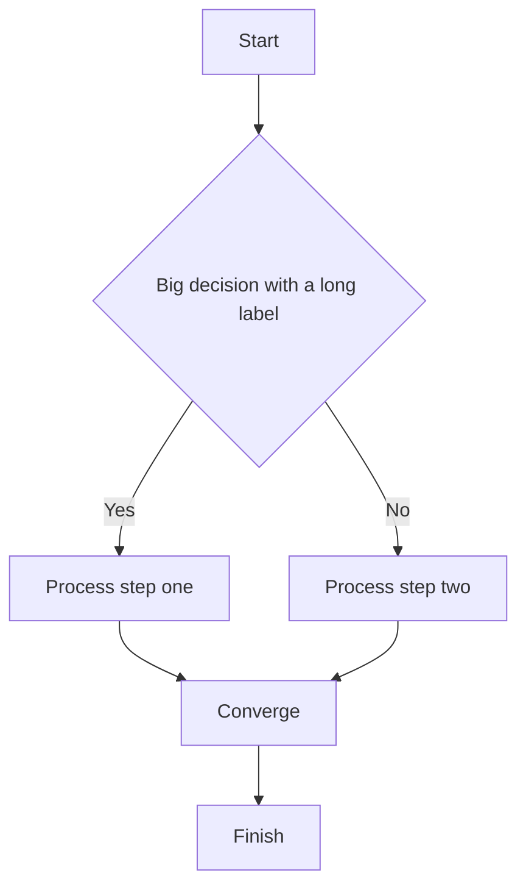
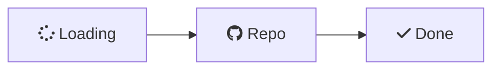
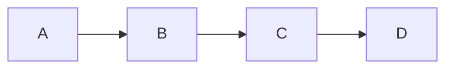
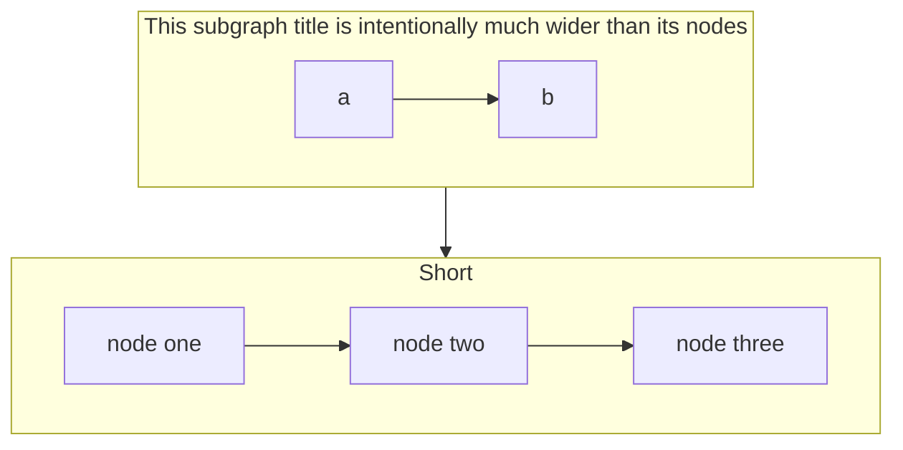

# Mermaid v0.3.1 Test Fixture

Used by the v0.3.1 manual test checklist (`MMD-*`). Covers the second-wave
additions: diagram popup viewer, FC-83b icon labels, `linkStyle interpolate`,
and subgraph-title width stability (#159). For `@pos` use
[`test_pos_hints.md`](test_pos_hints.md); for git graphs use
[`test_git_graphs.md`](test_git_graphs.md).

## 1. Popup viewer (click / Ctrl+Click / popup button)

**Expect:** hovering shows an *Open diagram in popup* button; clicking the
diagram (or Ctrl+Click, or the button) opens the zoom/pan popup. In the popup:
scroll/buttons zoom, **Hand** mode pans, **Select** mode does not, reset button
restores fit, close (X) dismisses. Dark/light follows the app theme.

## 2. FC-83b — Font Awesome icon prefixes stripped

**Expect:** labels render as **Loading**, **Repo**, **Done** — the `fa:fa-*` /
`fab:fa-*` prefix is stripped (glyph not drawn), no literal `fa:fa-` text.

## 3. linkStyle interpolate basis (smooth curves)

**Expect:** edges render as smooth Catmull-Rom curves rather than straight
orthogonal segments.

## 4. Subgraph title width stability (#159)

**Expect:** each subgraph box is wide enough for its title; the width is
**stable** across frames (no flicker/oscillation) when the title is the widest
element. Open in the popup (test 1) and confirm it stays stable while zooming.
