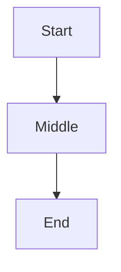

# Flowchart `%% @pos` manual layout fixture

Use this file to verify Ferrite applies `@pos` hints while Mermaid Live ignores
`%%` comments and keeps automatic layout.

## Valid hints (2 nodes pinned, one auto)

**Ferrite:** `A` top-left at (120, 80), `C` at (420, 280); `B` stays on the Sugiyama path; edges attach to the overridden rects.

**Mermaid Live:** same graph without manual positions (hints are comments).

## Invalid hint (warning only)

**Ferrite:** amber warning header — `Unknown node id 'Ghost' in @pos hint` — diagram still renders with auto layout.

**Mermaid Live:** renders normally; no warning (hints not validated).
